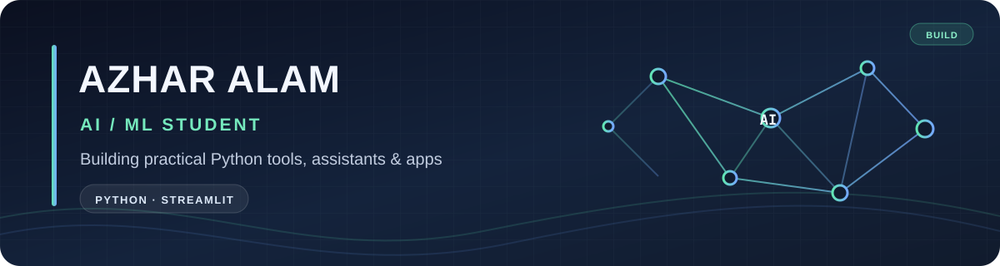

  

# Hi, I'm Azhar Alam 👋

### AI/ML student building practical Python tools, assistants, and interactive apps.

[GitHub Profile](https://github.com/azharalam0009) ·
[My Projects](https://github.com/azharalam0009?tab=repositories)

---

## 👨‍💻 About Me

I'm an AI/ML student who builds useful projects with Python, from small games to assistants that make everyday tasks easier. I enjoy turning ideas into working apps and improving them as I learn.

- 🐍 Building with **Python**
- 🖥️ Exploring desktop assistants and automation
- 🎓 Interested in useful AI and campus tools
- 🤝 Open to learning and collaborating on projects

## 🚀 Featured Projects

| Project | What it does |
| --- | --- |
| [Aira Desktop Assistant](https://github.com/azharalam0009/Aira-Assistant-Project) | A Windows voice and text assistant with reminders, notes, app and file commands, and optional OpenAI answers. |
| [Campus AI Assistant](https://github.com/azharalam0009/Campus-AI-Assistant) | A Python + Streamlit college information assistant with chat history and quick questions. |
| [The Perfect Guess](https://github.com/azharalam0009/The-Perfect-Guess) | A number guessing game with higher/lower hints and an attempt counter. |
| [Snake Water Game](https://github.com/azharalam0009/Snake-water-game) | A Python simulation of the classic Snake–Water–Gun game. |

## 🧰 Tech Stack

### Building with

  
  
  
  
  

### Currently learning

  
  
  
  
  

## 📊 GitHub Stats

  
  

  

  

## 🔗 Connect With Me

  
  
  

---

  Thanks for stopping by — feel free to explore my repositories! ✨

